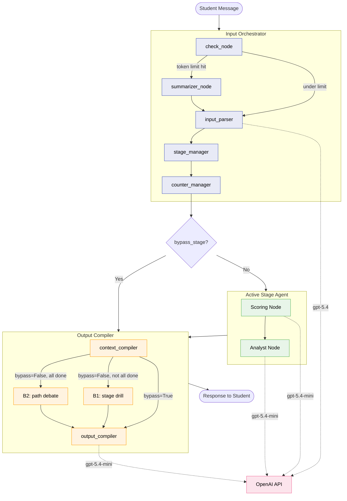

# PathFinder Architecture

**PathFinder is a multi-agent AI career counselor that drills Vietnamese students on their actual motivations — not surface-level answers — and maps genuine preferences to specific jobs, majors, and universities.** The system uses a supervisor-pattern LangGraph orchestrator that classifies student behavior per-turn while Python manages all counters, thresholds, and escalation logic. The key architectural insight: **LLMs are unreliable state managers but excellent classifiers**, so every counter, threshold, and routing decision lives in deterministic Python code.

## Problem

Most career counseling tools match test scores to school lists. Students give socially acceptable answers ("I want to help society"), counselors accept them, recommendations miss. PathFinder forces genuine engagement through Socratic drilling, compliance detection, and multi-turn behavioral pattern analysis — all conducted in Vietnamese for FPT University SE Scholarship candidates.

## Design Goals

| Goal | Metric | Trade-off |
|------|--------|-----------|
| **Genuine engagement** | Compliance detection rate, field confidence scores | Longer sessions, higher token cost |
| **Cost efficiency** | < $0.03/session average | Tiered models, token caps, conversation summarization |
| **Conversational fluency** | Vietnamese "em/minh" register, 2-5 sentences/turn | Constrains response length, limits information density |
| **Behavioral safety** | 6 counter escalation system, 10-turn window | Can end sessions prematurely for edge cases |
| **Architectural clarity** | Every field has a writer, reader, and exit condition | Adds documentation overhead |

---

## Architecture Overview



### Technology Stack

| Component | Technology | Why this, not the alternative |
|-----------|-----------|-------------------------------|
| **Orchestration** | LangGraph | Graph-based state machine with built-in checkpointing and conditional routing. Needed for multi-stage advisory flow with rebound/contradiction handling. Alternative (raw LangChain) lacks state persistence and graph visualization. |
| **LLM (orchestrator)** | GPT-5.4 | Needs to classify 7 message types + write 13 UserTag fields + detect multi-turn patterns in a single structured output call. Mini model misclassifies edge cases (compliance vs. genuine vagueness). |
| **LLM (agents + output)** | GPT-5.4-mini | Scoring, chatbot, and output compilation are simpler tasks — extract fields, ask one question, format response. 10x cheaper than full model. |
| **Validation** | Pydantic v2 | `ConfigDict(extra="forbid")` on all structured output classes prevents the LLM from hallucinating extra fields. `.model_dump()` enforces TypedDict compatibility at every state boundary. |
| **State** | TypedDict + optional root-graph checkpointer | LangGraph's `add_messages` reducer handles conversation append-only semantics. In the current architecture, only the root orchestrator needs a checkpointer when sessions need persistence; stage and output subgraphs do not own separate persistence. |
| **Language** | Python 3.13 | LangGraph and Pydantic v2 ecosystem. No alternative. |

---

## Agent Architecture

### Agent Registry

| Agent | Role | Model | Reads from state | Writes to state |
|-------|------|-------|-----------------|----------------|
| **check_node** | Token counting, route to summarizer | None (Python) | `messages` | `limit_hit` |
| **summarizer_node** | Compress conversation history | gpt-5.4-mini | `messages`, `summary`, `user_tag` | `messages` (removals), `summary` |
| **input_parser** | Classify message, tag user, detect patterns | gpt-5.4 | `messages`, `user_tag`, `stage` | `message_tag`, `user_tag`, `bypass_stage`, `stage` (partial) |
| **stage_manager** | Route to correct stage, detect contradictions | None (Python) | `stage`, `contradict_count`, `rebound_count` | `stage` (full), `contradict_count`, `rebound_count` |
| **counter_manager** | Manage all 6 decay counters + 10-turn window | None (Python) | `message_tag`, all counters, `trigger_window` | All counters, `trigger_window`, `escalation_pending` |
| **scoring_node** | Extract FieldEntry values; set `profile.done` when complete | gpt-5.4-mini | `{stage}_message`, current profile | Current profile fields |
| **analyst_node** | Write per-turn analysis to `stage_reasoning.{stage}` | gpt-5.4-mini | `{stage}_message`, current profile, `stage_reasoning` | `stage_reasoning.{stage}` |
| **context_compiler** | Build output LLM system prompt from state | None (Python) | `message_tag`, `user_tag`, `stage`, all counters | `compiler_prompt` |
| **output_compiler** | Generate final student-facing response | gpt-5.4-mini | `compiler_prompt`, `messages`, `stage` | `messages` (AI response), `{stage}_message` (AI response tagged to active context stages) |

### Stage Pipeline

Six sequential stages, each with the same subgraph topology:

```
thinking → purpose → goals → job → major → university
   0          1        2      3      4         5
```

Each stage agent runs: **Scoring Node** (extract fields, set `done`) → **Analyst Node** (write analysis to `stage_reasoning.{stage}`). No summarizer or chatbot in stage subgraphs — the output compiler is the sole student-facing response generator. It reads `stage_reasoning` via `PROFILE_CONTEXT_BLOCK` to understand what the stage agent found. A stage advances when its profile's `done` flag is set by the scoring node.

When all 6 profiles have `done=True`, the output compiler switches to **Case B2 (path debate)** — no separate stage agent. The compiler injects the debate frame as a prompt block.

### State Schema Overview

**`PathFinderState`** is a `TypedDict` organized in 4 layers:

| Layer | Fields | Purpose |
|-------|--------|---------|
| **Conversation** | `messages`, `summary`, `stage_reasoning`, 6 `{stage}_message` queues | Raw conversation + per-agent message routing |
| **Extracted Profiles** | `stage`, `thinking` through `university` (6 profiles) | Structured data extracted by scoring nodes |
| **Signals** | `message_tag`, `user_tag`, `bypass_stage` | Per-turn and persistent behavioral classifications |
| **Counters + System** | 6 counters, `trigger_window`, `path_debate_ready`, `stage_transitioned`, `escalation_*` | Python-managed behavioral thresholds and compiler gates |

<details>
<summary>MessageTag — per-turn, resets each turn (4 fields)</summary>

```python
class MessageTag(BaseModel):
    message_type: str = "true"
    # "true" | "vague" | "troll" | "genuine_update"
    # | "disengaged" | "avoidance" | "compliance"

    user_drill: bool = False        # answer needs more depth
    user_drill_reason: str = ""     # WHY — injected into output prompt
    response_tone: str = "socratic" # "socratic" | "firm" | "redirect"
```

</details>

<details>
<summary>UserTag — persistent, reasoning lock pattern (12 fields)</summary>

Orchestrator writes **ALL fields EVERY turn** (reasoning lock). No field goes stale.

```python
class UserTag(BaseModel):
    # ─── PSYCHOLOGICAL FLAGS (bool gate + reasoning string) ───
    # True = concern detected → reasoning injected into output block
    parental_pressure: bool = False
    parental_pressure_reasoning: str = ""
    burnout_risk: bool = False
    burnout_risk_reasoning: str = ""
    urgency: bool = False
    urgency_reasoning: str = ""
    core_tension: bool = False
    core_tension_reasoning: str = ""

    # ─── SELF-AUTHORSHIP (spectrum, no bool gate) ───
    self_authorship: str = ""  # empty = no block injected

    # ─── BEHAVIORAL REASONING (detection via MessageTag) ───
    compliance_reasoning: str = ""
    disengagement_reasoning: str = ""
    avoidance_reasoning: str = ""
```

</details>

> Full field reference with writer/reader/lifecycle contracts: [`state_architecture.md`](state_architecture.md)

---

## Key Design Decisions

### ADR-001: LLM Classifies, Python Counts

**Status**: Accepted

**Context**: Early prototype had the LLM managing counters directly — outputting `compliance_turns: 5` as part of its structured output. The LLM would "forget" to increment, sometimes jump from 3 to 7, and occasionally reset counters to 0 unprompted. Counter-based escalation was unreliable.

**Decision**: Strict boundary — the LLM outputs **classifications** (booleans, enum strings) and Python manages all **counting, thresholds, and escalation logic**. The LLM never sees counter values. It outputs `message_type: "compliance"` and Python increments `compliance_turns += 1`.

**Consequences**: Counter behavior is deterministic and testable. Adds a dedicated `counter_manager` node to the graph. The LLM prompt is simpler (no counter management instructions). Trade-off: the LLM cannot adjust its behavior based on "how many times" something happened — only Python can make threshold decisions.

### ADR-002: Reasoning Lock Pattern for UserTag

**Status**: Accepted

**Context**: UserTag fields (parental_pressure, burnout_risk, etc.) were originally simple bools/enums. The output compiler needed more context than "parental_pressure: True" to generate appropriate responses. Separate `authenticity_reasoning` and `psychological_reasoning` fields existed in state but duplicated information.

**Decision**: Each UserTag concept gets a **bool** (Python gate for counting/injection) paired with a **reasoning string** (context for the output LLM). The orchestrator writes **all UserTag fields every turn** — no field goes stale. The reasoning strings replace the standalone reasoning fields, eliminating 2 top-level state fields.

**Alternatives considered**:
- Enum-based levels (e.g., burnout_risk: "low"/"moderate"/"high") — rejected because the output LLM (gpt-5.4-mini) must then infer strategy from an abstract label. A descriptive string gives it actionable context directly.
- Separate reasoning fields — rejected because it duplicated signals and added state complexity.

**Consequences**: The orchestrator LLM must output 13 UserTag fields every turn (higher structured output complexity). `extra="forbid"` on the Pydantic model prevents field hallucination. The output compiler gets rich context without separate reasoning injection.

### ADR-003: Passive Decay Counters

**Status**: Accepted

**Context**: Students are inconsistent. A single troll message shouldn't permanently flag them. A student who was disengaged for 2 turns but then re-engages shouldn't carry that penalty forever.

**Decision**: All 6 behavioral counters use **passive decay**: `+1` when triggered, `max(0, count - 1)` when not. A student must exhibit **sustained** problematic behavior to hit escalation thresholds. Additionally, a **10-turn silent window** catches chronic low-grade patterns that decay keeps resetting (e.g., compliance detected 5/10 turns but never 4 consecutive).

**Consequences**: A student who trolls once and then engages genuinely will have their `troll_warnings` decay to 0 within a few turns. Escalation requires either sustained behavior (counter threshold) or chronic pattern (window threshold). Two independent detection mechanisms prevent both false positives (single bad turn) and false negatives (distributed bad behavior).

### ADR-004: Block-Based Prompt Assembly

**Status**: Accepted

**Context**: The output LLM needs different instructions depending on the student's state: bypass mode (greeting), normal counseling, or escalation (session end). Within normal counseling, 0-6 optional blocks can stack (compliance probe, parental pressure, core tension, etc.).

**Decision**: The `context_compiler` assembles a system prompt from **static base blocks** (always present, ~200 tokens) plus **volatile blocks** selected by Python logic. Three mutually exclusive cases (bypass ~400tok, stage ~600-1200tok, escalation ~300tok). Within stage mode, USER blocks are additive — multiple can stack.

**Consequences**: Token budget is predictable per case. Adding a new behavioral signal means adding one new block template and one condition in the compiler — no prompt rewrite needed. The output LLM never receives irrelevant instructions.

### ADR-005: Stage Agent Analyst Pattern (No Chatbot Node)

**Status**: Accepted (Entry 003, 2026-03-29)

**Context**: Original design had each stage subgraph run three nodes: `scoring_node` (extract fields) → `summarizer_node` (compress) → `chatbot_node` (generate question). The chatbot node wrote Vietnamese responses into `{stage}_message`. The output compiler, however, reads `state["messages"]` (global) not per-stage queues — so the chatbot output was never visible to the student. Two LLM calls per turn were running; only one was doing visible work.

**Decision**: Remove `chatbot_node` and `summarizer_node` from all 6 stage subgraphs. Replace chatbot with an **analyst node** that writes a prose analysis to `stage_reasoning.{stage}`. The output compiler reads `stage_reasoning` via `PROFILE_CONTEXT_BLOCK` and generates the student-facing response itself. The output compiler is the sole response generator.

**Alternatives considered**:
- Option A (keep chatbot, add `stage_draft` state field, output compiler adapts draft) — rejected: adds a new state field and a new `STAGE_DRAFT_BLOCK` in `output.py` for zero net gain. Output compiler already has `fields_needed` and `stage_status` from `_compute_stage_status()`.
- Keep summarizer per stage — rejected: each analyst node rewrites its full analysis each turn. Per-stage compression adds an LLM hop for data the analyst already has.

**Consequences**: Output compiler gets prose analysis context instead of a structured draft question. Stage subgraphs are simpler (2 nodes instead of 3) and no longer own their own checkpointers. Information flow is explicit: `{stage}_message` is only ever read by scoring and analyst nodes, while Python taggers append both the student's message and the output compiler's AI response into the relevant stage queues.

### ADR-006: Persistent Domain Memory (Python Tagger)

**Status**: Accepted (Entry 004, 2026-03-30)

**Context**: The orchestrator enforces a 2000-token limit via the `summarizer_node`. The global conversation `summary` naturally degrades over time, losing exact references to early stages (e.g., student's exact learning mode constraints). However, Stage Agents (like Job and Major) require high-fidelity, permanent recall of the domains they manage.

**Decision**: Split memory into two permanent layers: **Behavioral** and **Domain**. 
1. The global `SUMMARIZER_PROMPT` is gutted—it only tracks macro psychology, compliance, and routing events. 
2. A deterministic **Python Tagger** is added to `input_parser`. It reads `response.stage_related` from the LLM and instantly appends the raw Human Message to the matching `{stage}_message` queue.

**Alternatives considered**:
- Let stage agents use the global `messages` array — rejected: token limit would cause them to lose vital priors within 30 minutes.
- Let the summarizer track stage data — rejected: prompt bloat and hallucination risks.

**Consequences**: The system buffers reasoning agents from the context-decay of the routing layer. `job_message` acts as a perfect, untruncated memory vault for the Job Analyst. The Output Compiler similarly tags its AI responses into these queues to complete the loop.


## Cost Architecture

| Call | Model | Frequency | Est. tokens | Est. cost |
|------|-------|-----------|-------------|-----------|
| input_parser | gpt-5.4 | 1/turn | ~2000 in, ~500 out | ~$0.005 |
| scoring_node | gpt-5.4-mini | 1/turn (stage only) | ~1500 in, ~200 out | ~$0.0003 |
| analyst_node | gpt-5.4-mini | 1/turn (stage only) | ~1000 in, ~200 out | ~$0.0003 |
| output_compiler | gpt-5.4-mini | 1/turn | ~1500 in, ~300 out | ~$0.0003 |

**Per-turn cost**: ~$0.006. **Per-session (20 turns)**: ~$0.12.

**Token management**: `check_node` counts tokens per turn. At 2000 tokens, `summarizer_node` compresses the oldest 75% of messages. Each stage agent reads its own message queue (`{stage}_message`), not the full global history.

---

## Reliability: Counter System

Six decay counters protect against adversarial or disengaged behavior:

```
COUNTER              TRIGGER                 DECAY       WARN    ESCALATE
────────────────     ────────────────────    ─────────   ─────   ────────
troll_warnings       message_type="troll"    max(0,-1)   —       direct
compliance_turns     message_type="compliance" max(0,-1) —       at 10
disengagement_turns  message_type="disengaged" max(0,-1) >= 3    >= 4
avoidance_turns      message_type="avoidance" max(0,-1)  >= 3    >= 4
contradict_count     stage.contradict=True   max(0,-1)   —       direct
rebound_count        stage.rebound=True      max(0,-1)   —       direct
```

**10-turn silent window**: Every 10 turns, `trigger_window` checks if any counter triggered >= 5 times (50%). Compliance gets forced to 9 (one more chance). All others trigger `escalation_pending = True` directly. Window resets after each check.

**Failure modes**:

| Failure | Trigger | Mitigation |
|---------|---------|------------|
| LLM hallucinates field values | Structured output parsing | `ConfigDict(extra="forbid")` rejects unexpected fields |
| Counter never decays (stuck) | LLM consistently misclassifies | 10-turn window catches chronic 50%+ patterns |
| Session runs forever | No termination trigger hit | Token cap + turn count monitoring |
| Student gives up mid-session | Disengagement pattern | Warning at 3 turns, termination at 4 |
| Compliance masking real preferences | Surface answers pass scoring | Compliance counter escalates technique intensity over turns |

---

## Known Limitations

- **No persistence across sessions in the current test phase.** A checkpointer can be enabled later for conversation resume.
- **Single-language only.** Vietnamese responses, English code/docs. No multilingual support planned.
- **No external data sources.** University recommendations based on student profile, not live program data. Research agent (planned) will add web search.
- **Token cap needs tuning.** Orchestrator `check_node` threshold raised to 2000 tokens. Stage agents no longer have per-stage summarizers — analyst nodes rewrite their full analysis each turn. Global summarizer threshold still needs calibration with real user data.
- **4 of 6 stage prompts not yet audited.** `thinking_graph` and `purpose_graph` prompts audited (Entry 003). `goals`, `job`, `major`, `uni` prompts exist but are unaudited drafts.
- **Frontend not yet wired.** React 18 + Vite frontend built (in `zip/`). FastAPI endpoint and master graph not yet connected.
- **Output compiler B2 is a placeholder.** `PATH_DEBATE_BLOCK` exists but debate logic (synthesis, red-team challenges) is not yet implemented. Trigger condition (all 6 `done=True`) is wired.
- **`path_debate_ready` is intentionally narrow.** `stage_manager` gates B2 on all profiles being done plus blocking user-constraint checks. Tighten or loosen that gate only in Python, not in prompt logic.
- **ThinkingProfile MI/RIASEC seeding function not yet built.** `brain_type` and `riasec_top` are written by the frontend quiz. A Python function needs to map these → ThinkingProfile field initial confidences (e.g. kinesthetic → `learning_mode: hands-on, confidence=0.6`) before the thinking analyst node runs. LLM does NOT interpret test results directly.

---

> **File map**: State contract → [`state_architecture.md`](state_architecture.md) · Output compiler challenge → [`CHALLENGE.md`](CHALLENGE.md) · Pydantic models → [`backend/data/state.py`](backend/data/state.py) · Orchestrator → [`backend/orchestrator_graph.py`](backend/orchestrator_graph.py)

*Built by Anh Duc — FPT University SE Scholarship portfolio piece.*
